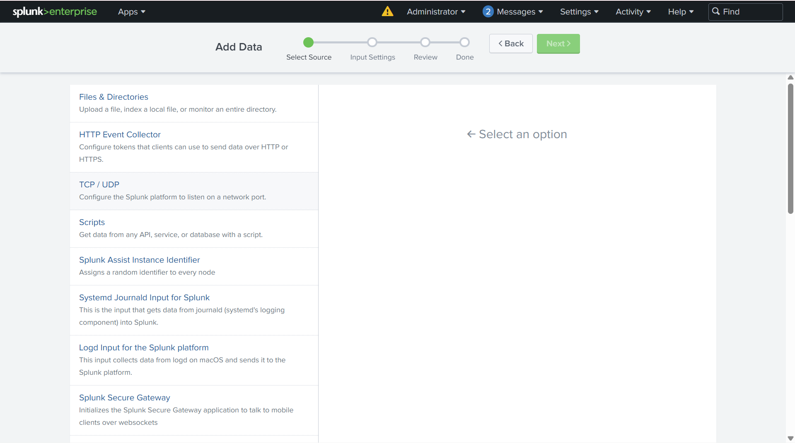
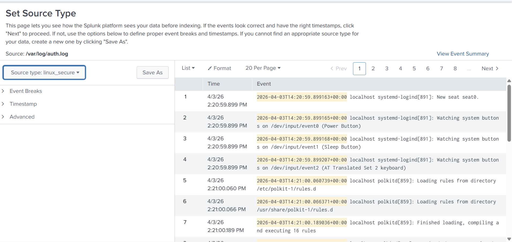
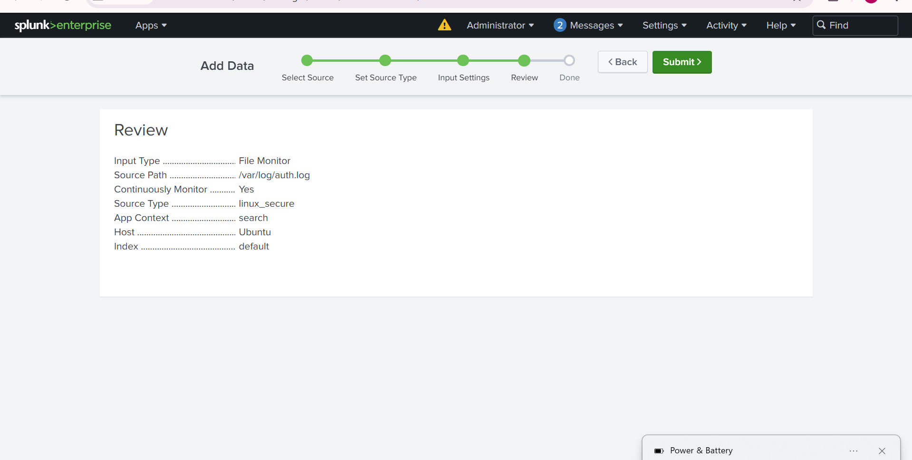
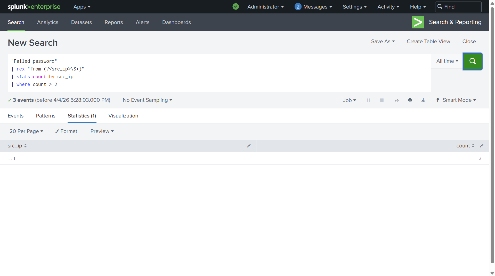

# 🔐 SSH Brute Force Detection using Splunk SIEM

## 📌 Project Overview

This project demonstrates how to detect SSH brute-force attacks using **Splunk SIEM** by analyzing Linux authentication logs.
The system ingests logs from `/var/log/auth.log`, identifies failed login attempts, and extracts attacker IP addresses to detect suspicious activity.


## 🎯 Objectives

* Monitor SSH authentication logs in real-time
* Detect multiple failed login attempts
* Identify source IP of attacker
* Build detection queries using Splunk SPL
* Simulate brute-force attack using Kali Linux


## 🛠️ Tools & Technologies

* Splunk Enterprise
* Ubuntu Linux (Log Source)
* Kali Linux (Attacker Machine)
* Hydra (Brute-force tool)
* SSH Service
* VirtualBox


## ⚙️ Project Setup

### 1. Install & Start Splunk

```bash
./splunk start
```

Access Splunk at:

```
http://localhost:8000
```


### 2. Add Log Data

* Navigate to: **Add Data → Files & Directories**
* Select:

```
/var/log/auth.log
```

* Set Source Type:

```
linux_secure
```


### 3. Enable SSH Service

```bash
sudo apt install openssh-server
sudo systemctl start ssh
```


### 4. Simulate Attack (Kali Linux)

```bash
hydra -l msfadmin -P /usr/share/wordlists/rockyou.txt ssh://<target-ip>
```


## 🔍 Detection Queries

### Basic Detection

```spl
"Failed password"
```

### Advanced Detection (Extract Attacker IP)

```spl
"Failed password"
| rex "from (?<src_ip>\S+)"
| stats count by src_ip
| where count > 2
```


## 📊 Results

* Detected multiple failed SSH login attempts
* Extracted source IP address (`::1` - localhost in this lab setup)
* Identified repeated login failures indicating brute-force behavior
* Demonstrated real-time log monitoring using Splunk

---

## 📸 Screenshots

### 1. Splunk Login


### 2. Splunk Dashboard


### 3. Add Data Source



### 4. Source Type Configuration



### 5. Review Configuration



### 6. Failed Password Logs


### 7. Detection Query Result




## 🧠 Key Learnings

* Hands-on experience with SIEM tools (Splunk)
* Log ingestion and parsing techniques
* Writing detection queries using SPL
* Understanding SSH brute-force attacks
* Basic SOC (Security Operations Center) workflow


## 🚀 Future Enhancements

* Create real-time alerts for brute-force detection
* Build dashboards for visualization
* Integrate email notifications
* Simulate external attacks (different IP instead of localhost)


## 📌 Conclusion

This project successfully demonstrates how Splunk SIEM can be used to detect SSH brute-force attacks by analyzing system logs. It provides practical exposure to real-world cybersecurity monitoring and threat detection techniques.

---

## 👨‍💻 Author

**Y.Pragnavi**
Cybersecurity Enthusiast
